# Generated Architecture Overview

> Generated from the normalized governance graph.

## Composition

- component: 29
- controller: 19
- document: 119
- job: 7
- model: 21
- policy: 3
- test: 84

## Diagram

```mermaid
graph LR
  application[Application]
  application_record[ApplicationRecord]
  component_showcase[ComponentShowcase]
  components[Components]
  concerns[Concerns]
  controllers[Controllers]
  current[Current]
  customer[Customer]
  customer_export[CustomerExport]
  customer_import[CustomerImport]
  customers[Customers]
  dashboards[Dashboards]
  domain_event[DomainEvent]
  feature_flag[FeatureFlag]
  grid_saved_view[GridSavedView]
  grid_saved_views[GridSavedViews]
  grids[Grids]
  health[Health]
  helpers[Helpers]
  home[Home]
  idempotency_record[IdempotencyRecord]
  import_run[ImportRun]
  installation[Installation]
  integration[Integration]
  lib[Lib]
  locale_preferences[LocalePreferences]
  marketing[Marketing]
  membership[Membership]
  memberships[Memberships]
  models[Models]
  notification[Notification]
  notification_delivery[NotificationDelivery]
  operations[Operations]
  organization[Organization]
  organization_invitation[OrganizationInvitation]
  organization_invitations[OrganizationInvitations]
  organizations[Organizations]
  passwords[Passwords]
  platform_role[PlatformRole]
  privacy_preference[PrivacyPreference]
  privacy_request[PrivacyRequest]
  privacy_requests[PrivacyRequests]
  requests[Requests]
  retention_enforcement[RetentionEnforcement]
  retention_policy[RetentionPolicy]
  services[Services]
  session[Session]
  sessions[Sessions]
  stored_file[StoredFile]
  tenant_selections[TenantSelections]
  ui[Ui]
  user[User]
  webhook_delivery[WebhookDelivery]
  webhook_endpoint[WebhookEndpoint]
```

## Contracts

- `distributions` v1
- `extensions` v1
- `platform` v1
- `releases` v1
- `upgrades` v1
