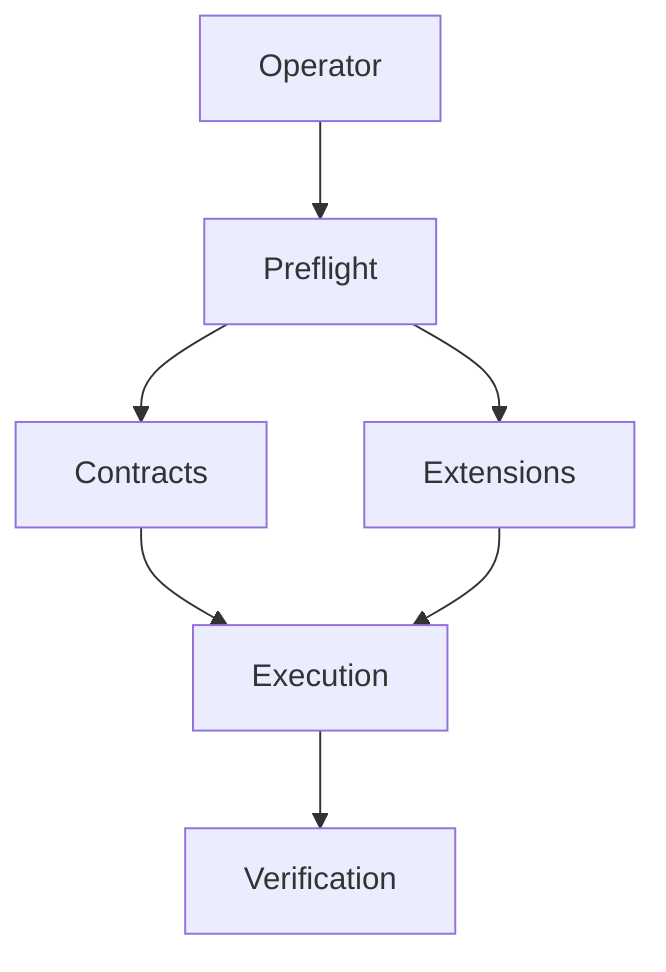
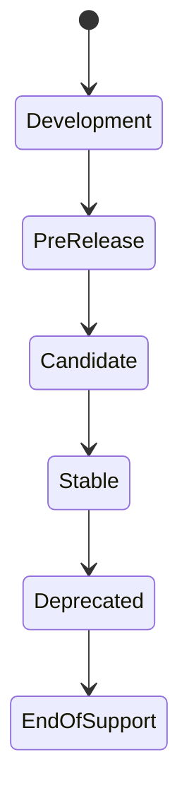
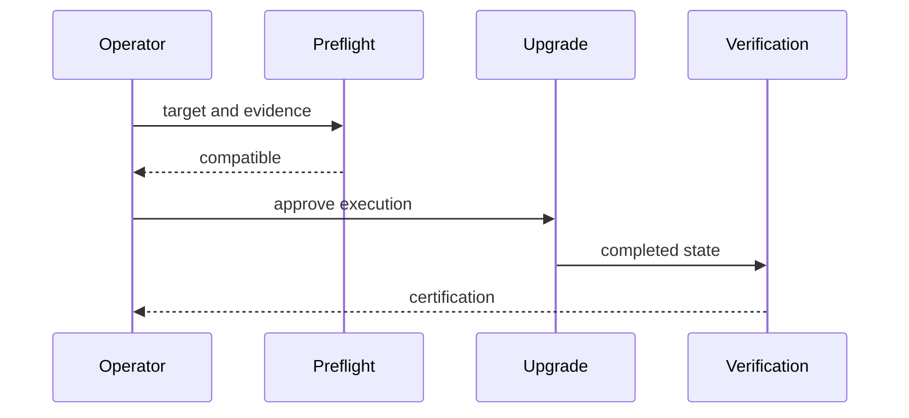
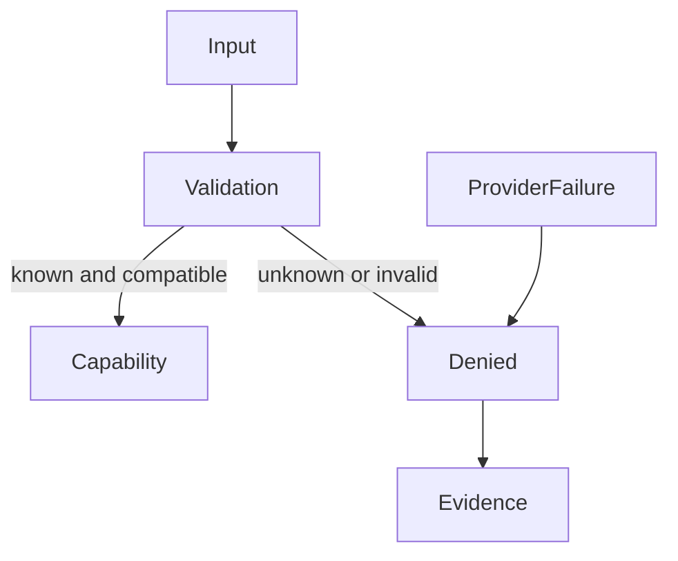
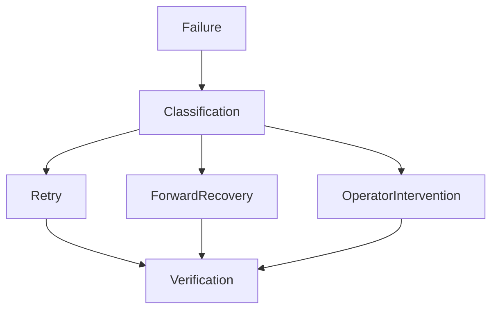

# Compatibility and Lifecycle Policy

This policy defines the supported environment, contract and lifecycle boundaries
for NomoTect pre-1.0 releases. Compatibility claims apply only to combinations
certified by CI or an explicitly documented deployment profile. A successful
local boot is not a compatibility certification.

## Supported environment matrix

| Layer | Supported baseline | Evidence |
| --- | --- | --- |
| Ruby | Version pinned by `.ruby-version` and `Gemfile.lock` | CI verify and packaging jobs |
| Rails | Version resolved by `Gemfile.lock` | test, lint and security analysis |
| PostgreSQL | Major version used by CI and documented deployment profiles | migrations, tests and restore certification |
| Containers | OCI image built from the repository Dockerfile | reproducible packaging certification |
| Browser UI | Current evergreen browsers with Hotwire and progressive enhancement | system and component tests |
| Deployment | Private VPS, Kamal and Render profiles | profile validation and packaging evidence |
| Extensions | Declared contract version that passes compatibility preflight | extension certification |
| Distribution | GitHub Releases and GHCR channels | distribution certification evidence |

The repository pins exact build inputs. Operators must not infer support for an
unlisted runtime, database, architecture or deployment service. Proposed matrix
changes require their own change fragment and production-like certification.

## Contract compatibility matrix

| Change | Pre-1.0 policy | Required operator action |
| --- | --- | --- |
| Additive optional field | Allowed in the current contract version | Upgrade consumers when convenient |
| New required field | New contract version or explicit migration | Complete preflight and migration |
| Removed or renamed field | Deprecation period and new contract version | Migrate before removal |
| Semantic behavior change | Architecture decision and release note | Review impact before upgrade |
| Extension API change | Compatibility-range update and extension certification | Upgrade or disable the extension |
| Persistent-state change | Registered upgrade operation with backup evidence | Enter maintenance mode and verify |
| Security correction | May shorten the normal deprecation period | Apply supported update promptly |

Readers must use the schema and implementation together. Unknown versions,
unknown capabilities and malformed manifests fail closed.

## Release lifecycle

| Stage | Purpose | Support boundary |
| --- | --- | --- |
| Development | Main-branch integration | No published compatibility promise |
| Pre-release | Versioned validation and operator feedback | Supported only for documented evaluation |
| Release candidate | Epic 10 representative-application certification | Candidate-specific compatibility matrix |
| Stable | Approved public contracts and lifecycle policy | Begins only after the v1.0 gate |
| Deprecated | Replacement exists and migration guidance is published | Remains readable during its notice window |
| End of support | Certification and fixes stop | Upgrade to a supported line is required |

The current `v0.9.0` line is pre-stable. Completing Epic 9 does not authorize
`v1.0.0`, long-term support or an enterprise support commitment.

## Deprecation policy

A deprecation notice identifies the affected contract, replacement, first
deprecated version, earliest removal version and migration procedure. Removal
must not occur in the same release that first announces a deprecation except for
an urgent security boundary with documented rationale.

Pre-1.0 versions may evolve quickly, but persisted state, extension contracts and
operator workflows still require explicit compatibility evidence. Stable support
windows will be approved during the Epic 10 release gate.

## Upgrade and extension lifecycle

Every upgrade runs compatibility preflight before mutation. The operator verifies
the target version, installed extensions, backup evidence, required maintenance
mode and registered operations. Extensions outside their declared compatibility
range remain unloaded. Provider failure never grants an entitlement or disables
a community capability.

After execution, post-upgrade verification certifies application, jobs, storage
and integration health. A failed irreversible operation enters forward recovery;
history is preserved and the same manifest cannot be replayed blindly.

## Architecture diagram

## Lifecycle state machine

## Upgrade sequence

## Security boundary

## Recovery flow

## Ownership and review

Platform maintainers own this policy. Deployment, upgrade, extension, release and
recovery changes must update it when they change a listed support boundary.
Repository Intelligence freshness certification is introduced by the dedicated
documentation-ownership task later in Phase 9.
